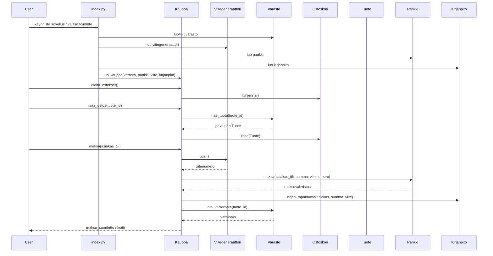

```mermaid

sequenceDiagram
    participant User
    participant Index as index.py
    participant Kauppa
    participant Viite as Viitegeneraattori
    participant Varasto
    participant Ostoskori
    participant Tuote
    participant Pankki
    participant Kirja as Kirjanpito

    User->>Index: käynnistä sovellus / valitse toiminto
    Index->>Varasto: luo/init varasto
    Index->>Viite: luo viitegeneraattori
    Index->>Pankki: luo pankki
    Index->>Kirja: luo kirjanpito
    Index->>Kauppa: luo Kauppa(varasto, pankki, viite, kirjanpito)

    User->>Kauppa: aloita_ostokset()
    Kauppa->>Ostoskori: tyhjenna()
    User->>Kauppa: lisaa_ostos(tuote_id)
    Kauppa->>Varasto: hae_tuote(tuote_id)
    Varasto-->>Kauppa: palauttaa Tuote
    Kauppa->>Ostoskori: lisaa(Tuote)
    User->>Kauppa: maksa(asiakas_tili)
    Kauppa->>Viite: uusi()
    Viite-->>Kauppa: viitenumero
    Kauppa->>Pankki: maksa(asiakas_tili, summa, viitenumero)
    Pankki-->>Kauppa: maksuvahvistus
    Kauppa->>Kirja: kirjaa_tapahtuma(asiakas, summa, viite)
    Kauppa->>Varasto: ota_varastosta(tuote_id)
    Varasto-->>Kauppa: vahvistus
    Kauppa-->>User: maksu_suoritettu / kuitti

```

